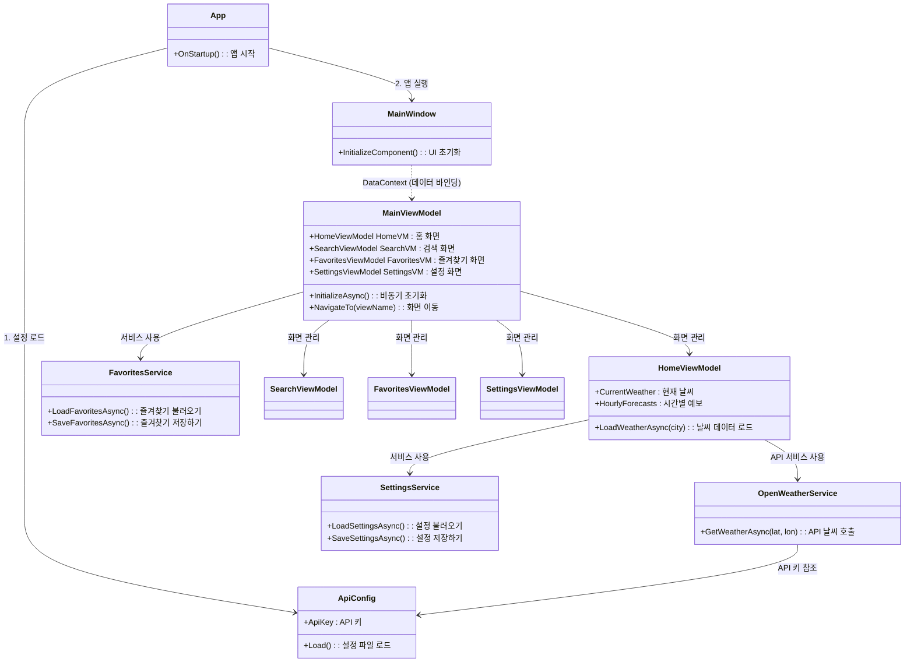
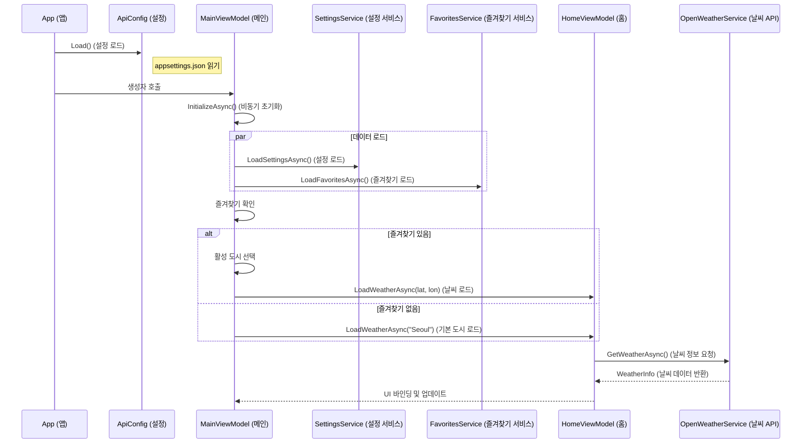

# SkyWatch 프로젝트 코드 분석

이 문서는 SkyWatch WPF 애플리케이션의 구조, 논리 흐름 및 주요 구성 요소에 대한 자세한 분석을 제공합니다.

## 1. 프로젝트 구조 개요

이 프로젝트는 UI(View), 비즈니스 로직(ViewModel), 데이터(Model/Service)를 분리하는 **MVVM (Model-View-ViewModel)** 아키텍처 패턴을 따릅니다.

### 디렉토리 구조
- **Views**: UI 정의 (XAML).
- **ViewModels**: View와 데이터를 연결하고 애플리케이션 로직을 처리합니다.
- **Models**: 날씨 데이터, 도시 정보 등을 나타내는 데이터 구조입니다.
- **Services**: 외부 데이터 액세스(API 호출) 및 로컬 저장소(파일)를 처리합니다.
- **Messages**: `WeakReferenceMessenger`를 사용하여 ViewModel 간의 통신을 위한 이벤트 메시지입니다.
- **Helpers**: 유틸리티 클래스 (예: 국가 코드를 국기로 변환).
- **Converters**: XAML 값 변환기.

---

## 2. 다이어그램 개요

### 클래스 구조 (주요 관계)



### 실행 흐름 (시작 시퀀스)



---

## 3. 주요 구성 요소 및 함수

### 1. **App.xaml.cs** (진입점)
- **`OnStartup`**: 애플리케이션의 진입점입니다.
  - **역할**: 애플리케이션을 초기화하고 전역 설정을 로드합니다.
  - **사용**: UI가 표시되기 전에 API 키가 준비되도록 `ApiConfig.Load()`를 호출합니다.

### 2. **ApiConfig.cs** (환경 설정)
- **`Load()`**:
  - **역할**: `appsettings.json`에서 `ApiKey`를 읽어옵니다. 로컬 파일 시스템과 임베디드 리소스를 모두 확인합니다.
  - **사용**: `App.xaml.cs`에서 한 번 호출됩니다. `OpenWeatherService`가 API 요청을 인증하는 데 사용됩니다.

### 3. **MainViewModel.cs** (오케스트레이터 / 조정자)
- **`생성자 (Constructor)`**:
  - **역할**: 의존성 주입(서비스 객체 생성) 및 자식 ViewModel(`HomeVM`, `SearchVM` 등)을 초기화합니다.
  - **사용**: 메시지 메신저(`WeakReferenceMessenger`)를 등록하고 `InitializeAsync()`를 시작합니다.
- **`InitializeAsync()`**:
  - **역할**: 비동기 초기화 로직을 수행합니다.
  - **흐름**: 설정 로드 → 즐겨찾기 로드 → 홈 화면에 표시할 도시 결정(활성 즐겨찾기 도시 또는 기본값 "Seoul").
- **`NavigateTo(string viewName)`**:
  - **역할**: `CurrentView` 속성을 변경하여 화면 탐색 로직을 처리합니다.
  - **사용**: 네비게이션 바(탐색 모음)를 사용하거나 검색/즐겨찾기 화면에서 도시를 선택할 때 호출됩니다.
- **`Receive(Message)`**:
  - **역할**: ViewModel 간의 통신(메시지 수신)을 처리합니다.
  - **사용**: 검색 화면에서 보낸 `CitySelectedMessage`에 반응하여 홈 화면으로 전환하고 선택한 도시의 날씨 데이터를 로드합니다.

### 4. **HomeViewModel.cs** (메인 뷰모델)
- **`LoadWeatherAsync(city/lat,long)`**:
  - **역할**: 홈 화면의 핵심 비즈니스 로직입니다.
  - **흐름**: `IsLoading = true` 설정 → `_weatherService.GetWeatherAsync` 호출 → `CurrentWeather`, `HourlyForecasts`, `DailyForecasts` 데이터 업데이트 → `IsLoading = false` 설정.
  - **사용**: 앱 시작 시 또는 새로운 도시가 선택될 때 `MainViewModel`에 의해 호출됩니다.

### 5. **OpenWeatherService.cs** (데이터 제공 서비스)
- **`GetWeatherAsync`**:
  - **역할**: OpenWeatherMap API에서 날씨 데이터를 가져옵니다.
  - **사용**: `ApiConfig.ApiKey`를 사용하여 HTTP 요청을 구성하고 전달받은 JSON 응답을 C# 모델 객체로 역직렬화(Deserialize)합니다.

---

## 4. 실행 흐름 요약

1.  **애플리케이션 실행**:
    -   `App`이 시작되고 `ApiConfig.Load()`를 호출하여 API 키를 가져옵니다.
    -   `MainWindow`가 생성됩니다. `MainViewModel`이 인스턴스화되어 `DataContext`로 할당됩니다.

2.  **초기화 (`MainViewModel`)**:
    -   `InitializeAsync`가 호출됩니다 (Fire-and-forget).
    -   **설정**: 사용자 환경설정(단위, 언어)을 로드합니다.
    -   **즐겨찾기**: `favorites.json`에서 저장된 도시를 로드합니다.
    -   **초기 화면**: 즐겨찾기가 있으면 활성 도시를 로드하고, 없으면 기본값인 "Seoul"로 설정합니다.

3.  **날씨 로딩 (`HomeViewModel`)**:
    -   날씨 로드 요청을 받습니다 (`LoadWeatherAsync` 통해).
    -   HTTP를 통해 `OpenWeatherService`를 호출합니다.
    -   ObservableProperties (`CurrentWeather`, `HourlyForecasts`)를 업데이트하며, 이는 데이터 바인딩을 통해 UI를 자동으로 업데이트합니다.

4.  **사용자 상호작용**:
    -   **탐색**: 사이드바 버튼을 클릭하면 `NavigateTo` 명령이 호출되어 `CurrentView`가 전환됩니다.
    -   **검색**: `SearchViewModel`이 `CitySelectedMessage`를 보냅니다. `MainViewModel`이 이를 수신하여 홈으로 전환하고 `HomeViewModel.LoadWeatherAsync`를 새 좌표로 호출합니다.
    -   **즐겨찾기**: 별 아이콘을 토글하면 `ToggleFavoriteMessage`가 전송됩니다. `MainViewModel`이 `FavoriteCities` 컬렉션을 업데이트하고 `FavoritesService`를 통해 저장합니다.

---

## 5. 배포 및 패키징 (Deployment & Packaging)

SkyWatch 애플리케이션은 사용자 편의성과 실행 환경에 따라 두 가지 방식으로 패키징되었습니다. `.NET CLI`(`dotnet publish`)를 사용하여 빌드 및 배포가 구성되었습니다.

> [!IMPORTANT]
> 두 패키징 방식 모두 실행 시 API 키를 읽어오기 위해 `appsettings.json` 파일이 필요합니다. `.csproj` 파일의 빌드 설정을 통해 배포 시 `appsettings.json` 파일이 실행 파일(`.exe`)과 함께 출력 폴더로 자동 복사되도록 구성되어 있습니다. 사용자는 실행 파일과 `appsettings.json` 파일을 항상 같은 폴더에 함께 두어야 합니다.

### 5.1 단일 파일 독립 실행형 (Self-Contained Single File)
- **특징**: 대상 PC에 .NET 8 런타임이 설치되어 있지 않아도 즉시 실행 가능한 형태입니다. 애플리케이션과 필요한 .NET 런타임이 하나의 `.exe` 파일(약 162MB)로 병합됩니다.
- **배포 폴더**: `SkyWatch/publish_final`
- **장점**: 배포가 매우 단순하며, 사용자는 추가 설치 없이 실행 파일과 `appsettings.json`만 다운로드하여 바로 실행할 수 있습니다.
- **실행 명령어**:
  ```bash
  dotnet publish -c Release -r win-x64 --self-contained true -p:PublishSingleFile=true -p:IncludeNativeLibrariesForSelfExtract=true -o ./publish_final
  ```

### 5.2 단일 파일 프레임워크 종속형 (Framework-Dependent Single File)
- **특징**: 실행하려는 PC에 .NET 8 Desktop Runtime 환경이 사전 설치되어 있어야 합니다. 애플리케이션 로직만 포함하므로 실행 파일 크기(약 500KB 내외)가 매우 작습니다.
- **배포 폴더**: `SkyWatch/publish_framework_dependent`
- **장점**: 용량이 매우 작아 배포 및 업데이트가 빠르고 효율적이며, 이미 .NET 런타임이 설치된 환경에 배포할 때 유리합니다.
    appsettings.json 우클릭 → 속성 빌드 작업: 포함 리소스, 항상 복사 or 새 버전 복사
- **실행 명령어**:
  ```bash
  dotnet publish -c Release -r win-x64 --self-contained false -p:PublishSingleFile=true -p:IncludeAllContentForSelfExtract=true -o ./publish_test

  ```
