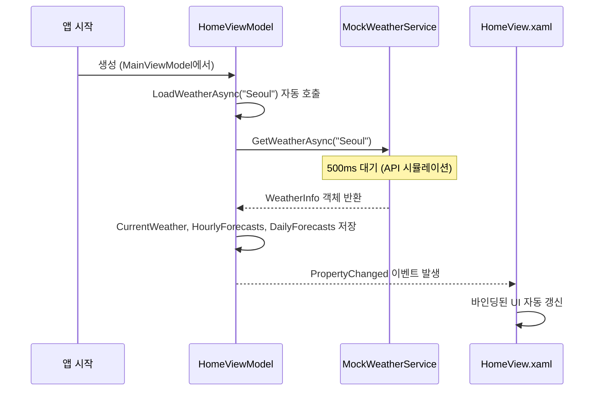

# Stage 2 워크스루 — 홈 화면 날씨 데이터 & UI

## 전체 구조

```
SkyWatch/
├── Models/
│   └── WeatherData.cs           ← 데이터 그릇 (클래스 정의)
├── Services/
│   ├── IWeatherService.cs       ← "이런 기능이 있어야 해" (인터페이스)
│   └── MockWeatherService.cs    ← "가짜 데이터 제공자" (테스트용)
├── Converters/
│   ├── WeatherIconConverter.cs  ← XAML에서 아이콘 코드 → 이모지 변환
│   └── RatioToWidthConverter.cs ← XAML에서 비율(0~1) → 픽셀 너비 변환
├── ViewModels/
│   └── HomeViewModel.cs         ← 화면에 보여줄 데이터 + 명령 관리
├── Views/
│   └── HomeView.xaml            ← 실제 화면 레이아웃 (XAML)
└── Themes/
    └── DarkTheme.xaml           ← 색상/스타일 사전
```

---

## 데이터가 화면에 표시되기까지의 흐름



---

## 파일별 상세 설명

### 1. `Models/WeatherData.cs` — 데이터 그릇

날씨 데이터를 담는 4개의 클래스입니다. 직접 로직은 없고, 단순히 "어떤 값들이 있는지" 정의합니다.

```
WeatherInfo (전체 묶음)
├── CurrentWeather  ← 현재 날씨
├── List<HourlyForecast>  ← 시간별 예보 (여러 개)
└── List<DailyForecast>   ← 주간 예보 (여러 개)
```

| 클래스 | 주요 프로퍼티 | 역할 |
|--------|-------------|------|
| `CurrentWeather` | CityName, Temperature, Humidity, WindSpeed 등 | Hero 카드 + Stats Grid |
| `HourlyForecast` | Time, Temperature, IconCode, RainChance, **IsNow** | 시간별 예보 리스트 |
| `DailyForecast` | DayName, TempMax, TempMin, **IsToday**, TempBarRatio | 주간 예보 리스트 |
| `WeatherInfo` | Current, HourlyForecasts, DailyForecasts | 위 3개를 하나로 묶음 |

> [!TIP]
> `IsNow`, `IsToday` 같은 bool 값은 **XAML DataTrigger**에서 하이라이트 처리에 사용됩니다.
> `TempBarRatio` (0.0~1.0)는 온도바 너비 계산에 사용됩니다.

---

### 2. `Services/IWeatherService.cs` — 서비스 인터페이스

```csharp
public interface IWeatherService
{
    Task<WeatherInfo> GetWeatherAsync(string city);
}
```

**왜 인터페이스를 만드나?**

```
HomeViewModel → IWeatherService(인터페이스)를 바라봄
                    ↑
          ┌─────────┴─────────┐
    MockWeatherService    OpenWeatherService (Stage 3)
     (가짜 데이터)           (실제 API)
```

ViewModel은 `IWeatherService`만 알면 됩니다. 뒤에 뭐가 붙든 상관없이 `GetWeatherAsync("Seoul")`만 호출하면 결과가 옵니다. 나중에 실제 API로 교체할 때 **ViewModel 코드는 전혀 안 바꿔도 됩니다**.

**왜 `Task<T>` 비동기인가?**

```
[동기식]  UI스레드: ──API호출────대기(3초)────응답처리── → 3초간 앱이 멈춤!
[비동기]  UI스레드: ──API호출──(자유)──(자유)──응답처리── → 대기 중에도 앱 정상 동작
```

---

### 3. `Services/MockWeatherService.cs` — 가짜 데이터 제공자

```csharp
public async Task<WeatherInfo> GetWeatherAsync(string city)
{
    await Task.Delay(500);  // ← 네트워크 대기 시뮬레이션
    return new WeatherInfo
    {
        Current = new CurrentWeather { CityName = "Seoul", Temperature = -2, ... },
        HourlyForecasts = new List<HourlyForecast> { ... },
        DailyForecasts = new List<DailyForecast> { ... }
    };
}
```

| 항목 | 값 | UI 위치 |
|------|-----|---------|
| 도시 | Seoul (KR) | Hero 카드 상단 |
| 온도 | -2° (체감 -7°) | Hero 카드 중앙 |
| 최고/최저 | 1° / -5° | Hero 카드 하단 |
| 습도/풍속/가시거리/UV | 45% / 3.2m/s / 10km / 3 | Stats Grid 4칸 |
| 시간별 | 6개 항목 (첫 번째가 IsNow=true) | 시간별 예보 |
| 주간 | 7일 (첫 번째가 IsToday=true) | 주간 예보 |

> [!NOTE]
> Stage 3에서 OpenWeatherMap API를 연동하면 이 파일은 **테스트 용도**로만 남기고, 실제 서비스를 별도로 만듭니다.

---

### 4. `Converters/WeatherIconConverter.cs` — 아이콘 변환

XAML에서 바인딩할 때 값을 변환해주는 도우미입니다.

```
입력: "01d" (맑음, 낮) → 출력: "☀️"
입력: "01n" (맑음, 밤) → 출력: "🌙"
입력: "10d" (비, 낮)   → 출력: "🌧"
```

**XAML에서 사용법:**
```xml
<TextBlock Text="{Binding IconCode, 
                  Converter={StaticResource WeatherIconConverter}}"/>
```

`IconCode`에 "01d"가 들어있으면 → Converter가 "☀️"로 바꿔서 → TextBlock에 표시

---

### 5. `Converters/RatioToWidthConverter.cs` — 비율→픽셀 변환

주간 예보의 **온도바 너비** 계산용입니다.

```
입력: TempBarRatio = 0.7 (0~1 비율)
파라미터: 60 (최대 너비 px)
출력: 0.7 × 60 = 42px
```

```xml
<Border Width="{Binding TempBarRatio, 
                Converter={StaticResource RatioToWidthConverter}, 
                ConverterParameter=60}"/>
```

---

### 6. `ViewModels/HomeViewModel.cs` — 화면 데이터 관리자

```
HomeViewModel
├── [프로퍼티] CurrentWeather      ← Hero 카드 + Stats Grid에 바인딩
├── [프로퍼티] HourlyForecasts     ← 시간별 예보 리스트에 바인딩
├── [프로퍼티] DailyForecasts      ← 주간 예보 리스트에 바인딩
├── [프로퍼티] IsLoading           ← 로딩 중 상태
├── [프로퍼티] HasError / ErrorMessage ← 에러 상태
├── [커맨드] LoadWeatherCommand    ← 최초 데이터 로드
└── [커맨드] RefreshWeatherCommand ← 🔄 버튼 클릭 시 새로고침
```

**핵심: `[ObservableProperty]`의 역할**

```csharp
[ObservableProperty]
private CurrentWeather? currentWeather;
// ↑ CommunityToolkit이 자동으로 아래를 생성:
// public CurrentWeather? CurrentWeather { get; set; }  ← 대문자 프로퍼티
// + PropertyChanged 이벤트 자동 발생
```

값이 바뀌면 → `PropertyChanged` 이벤트 발생 → XAML 바인딩이 감지 → **UI 자동 갱신**

---

### 7. `Views/HomeView.xaml` — 화면 레이아웃

```
HomeView.xaml (ScrollViewer로 감싸진 전체 구조)
│
├── 🔍 Top Bar ──────────────────────────────────────
│   ├── "도시를 검색하세요" (Placeholder)
│   ├── 🔄 갱신 버튼 → RefreshWeatherCommand
│   └── °C 뱃지
│
├── 🌤 Hero Card ────────────────────────────────────
│   ├── 왼쪽: Seoul KR / 흐림 / -2° / ↑1° ↓-5° 체감-7°
│   └── 오른쪽: 🌥 큰 이모지 + 갱신 시간
│
├── 📊 Stats Grid (4칸 가로 배치) ───────────────────
│   ├── 💧 습도 45%
│   ├── 💨 풍속 3.2m/s
│   ├── 👁 가시거리 10km
│   └── ☀️ UV 지수 3
│
└── 📅 Bottom Row (2칸 가로 배치) ───────────────────
    ├── 시간별 예보 (가로 스크롤)
    │   ├── [지금] ← IsNow=true 하이라이트
    │   ├── [15시]
    │   ├── [16시] 🌧 40% ← 강수확률 표시
    │   └── ...
    └── 주간 예보 (세로 리스트)
        ├── [오늘] ← IsToday=true 하이라이트
        ├── 내일  ☀  맑음  0%  [-7°━━━━━2°]
        ├── 수    🌧  비    60% [-3°━━1°]
        └── ...
```

**XAML 데이터 바인딩 예시:**
```xml
<!-- ViewModel의 CurrentWeather.Temperature 값을 표시 -->
<TextBlock Text="{Binding CurrentWeather.Temperature, StringFormat='{}{0:0}°'}"/>
<!--  결과: "-2°"  -->
```

**DataTrigger 예시 (조건부 스타일):**
```xml
<!-- IsNow=true이면 배경색과 텍스트 변경 -->
<DataTrigger Binding="{Binding IsNow}" Value="True">
    <Setter TargetName="hourBorder" Property="Background" Value="그래디언트"/>
    <Setter TargetName="timeText" Property="Text" Value="지금"/>
</DataTrigger>
```

---

### 8. `Themes/DarkTheme.xaml` — 디자인 사전

**이 파일은 로직이 없고, 순수하게 디자인 정보만 담고 있습니다.**

두 가지 종류의 정보가 있습니다:

#### A. 색상 브러시 (Brush) — "어떤 색을 쓸지"

```xml
<SolidColorBrush x:Key="BackgroundPrimaryBrush" Color="#0A0E1A"/>  ← 어두운 배경
<SolidColorBrush x:Key="TextPrimaryBrush" Color="#FFFFFF"/>        ← 흰색 텍스트
<SolidColorBrush x:Key="AccentCyanBrush" Color="#4FA3FF"/>         ← 강조색 (파란색)
```

#### B. 스타일 (Style) — "어떤 모양으로 그릴지"

```xml
<Style x:Key="GlassCardStyle" TargetType="Border">
    <Setter Property="Background" Value="#0BFFFFFF"/>   ← 반투명 흰색
    <Setter Property="CornerRadius" Value="20"/>         ← 둥근 모서리
</Style>
```

#### 적용 원리

```
App.xaml
  └── MergedDictionaries에 DarkTheme.xaml 로드
        ↓
HomeView.xaml에서 이름으로 참조
  "{DynamicResource TextPrimaryBrush}" → #FFFFFF (흰색)

나중에 LightTheme.xaml로 교체하면:
  "{DynamicResource TextPrimaryBrush}" → #1A1A2E (어두운색)
  → UI 전체 색상이 한 번에 전환!
```

---

## 빌드 결과

✅ `dotnet build` — **에러 0, 경고 0**

## 실행 방법

```powershell
cd SkyWatch
dotnet run
```
