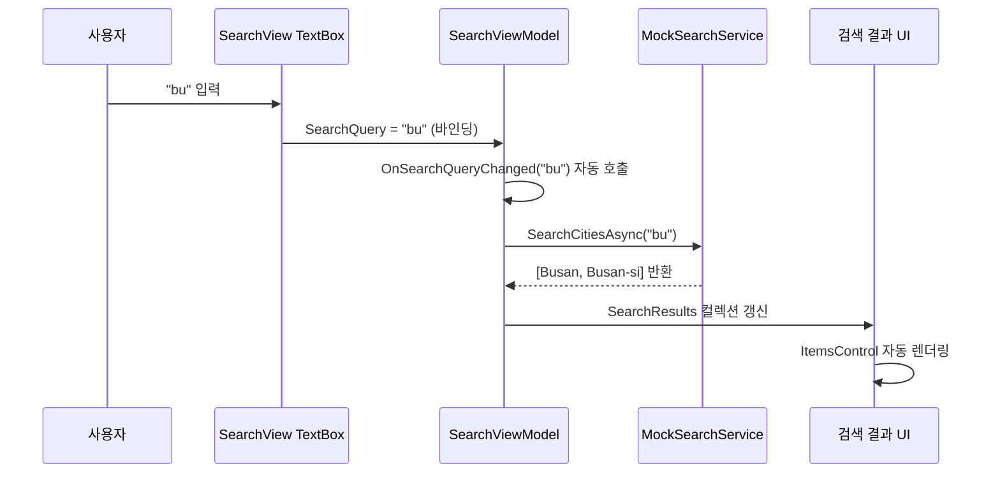

# Stage 3 워크스루 — 즐겨찾기 패널 + 검색 화면

## 전체 구조 (Stage 3 추가분)

```
SkyWatch/
├── Models/
│   ├── WeatherData.cs          ← (Stage 2)
│   ├── FavoriteCity.cs         ← NEW: 즐겨찾기 도시 모델
│   └── SearchResult.cs         ← NEW: 검색 결과 모델
├── Services/
│   ├── IWeatherService.cs      ← (Stage 2)
│   ├── MockWeatherService.cs   ← (Stage 2)
│   └── MockSearchService.cs    ← NEW: 도시 검색 더미 서비스
├── ViewModels/
│   ├── MainViewModel.cs        ← MODIFIED: 즐겨찾기 데이터 추가
│   └── SearchViewModel.cs      ← MODIFIED: 검색 로직 추가
├── Views/
│   └── SearchView.xaml         ← MODIFIED: 검색 화면 UI
└── MainWindow.xaml             ← MODIFIED: 3열 레이아웃 + 즐겨찾기 패널
```

---

## 앱 레이아웃 변화

```
Stage 2 레이아웃:
┌──────┬─────────────────────────────┐
│사이드 │                             │
│ 바   │      메인 콘텐츠 (*)         │
│(68px)│                             │
└──────┴─────────────────────────────┘

Stage 3 레이아웃:
┌──────┬─────────────────────┬───────┐
│사이드 │                     │즐겨찾기│
│ 바   │  메인 콘텐츠 (*)     │ 패널  │
│(68px)│                     │(240px)│
└──────┴─────────────────────┴───────┘
```

`MainWindow.xaml`의 Grid 구조가 **2열 → 3열**로 변경:

```xml
<Grid.ColumnDefinitions>
    <ColumnDefinition Width="68"/>   <!-- 사이드바 -->
    <ColumnDefinition Width="*"/>    <!-- 메인 콘텐츠 -->
    <ColumnDefinition Width="240"/>  <!-- 즐겨찾기 패널 (NEW) -->
</Grid.ColumnDefinitions>
```

---

## 파일별 상세 설명

### 1. `Models/FavoriteCity.cs` — 즐겨찾기 도시 모델

```
FavoriteCity
├── CityName     ← "Seoul"
├── CountryCode  ← "KR"
├── FlagEmoji    ← "🇰🇷"
├── Temperature  ← -2
├── IconCode     ← "04d" (WeatherIconConverter로 이모지 변환)
└── IsActive     ← true/false (DataTrigger로 하이라이트)
```

| 프로퍼티 | 타입 | UI 역할 |
|---------|------|---------|
| `FlagEmoji` | string | 도시 카드 왼쪽 아이콘 |
| `IsActive` | bool | 활성 도시 하이라이트 + 시안 도트 표시 |
| `IconCode` | string | WeatherIconConverter로 변환 후 이모지 표시 |

---

### 2. `Models/SearchResult.cs` — 검색 결과 모델

```
SearchResult
├── CityName     ← "Busan"
├── CountryName  ← "대한민국 · 부산광역시"
├── FlagEmoji    ← "🇰🇷"
├── Temperature  ← 3
└── IsTopResult  ← true (첫 번째 결과 하이라이트)
```

> [!TIP]
> `IsTopResult`는 검색 결과 중 첫 번째 항목에만 `true`로 설정되어, XAML DataTrigger에서 파란색 배경 하이라이트를 적용합니다.

---

### 3. `Services/MockSearchService.cs` — 도시 검색 서비스

```csharp
public Task<List<SearchResult>> SearchCitiesAsync(string query)
{
    // 9개 도시 더미 DB에서 필터링
    var results = allCities
        .Where(c => c.CityName.Contains(query)     // 도시명으로 검색
                  || c.CountryName.Contains(query))  // 국가명으로도 검색
        .ToList();

    if (results.Count > 0)
        results[0].IsTopResult = true;  // 첫 결과 하이라이트

    return Task.FromResult(results);
}
```

**등록된 더미 도시 9개:**

| 도시 | 국가 | 온도 |
|------|------|------|
| Seoul | 대한민국 · 서울특별시 | -2° |
| Busan | 대한민국 · 부산광역시 | 3° |
| Busan-si | 대한민국 · 부산 | 3° |
| Incheon | 대한민국 · 인천광역시 | -3° |
| Tokyo | 일본 · 도쿄도 | 8° |
| New York | 미국 · 뉴욕주 | 5° |
| London | 영국 · 잉글랜드 | 3° |
| Paris | 프랑스 · 일드프랑스 | 6° |
| Beijing | 중국 · 베이징시 | 1° |

---

### 4. `ViewModels/MainViewModel.cs` — 즐겨찾기 데이터 추가

Stage 2의 네비게이션 관리에 **즐겨찾기 데이터**가 추가되었습니다:

```
MainViewModel (Stage 3 추가분)
├── FavoriteCities  ← ObservableCollection<FavoriteCity> (4개 도시)
├── SunriseTime     ← "07:22"
├── SunsetTime      ← "18:05"
└── DaylightDuration ← "낮 10시간 43분"
```

**왜 MainViewModel에?**

즐겨찾기 패널은 `MainWindow.xaml`에 직접 배치됩니다 (HomeView 안이 아님). `MainWindow`의 `DataContext`가 `MainViewModel`이므로, 즐겨찾기 데이터도 여기에 있어야 바인딩이 됩니다.

```
MainWindow.xaml
├── DataContext = MainViewModel
├── Column 0: 사이드바
├── Column 1: ContentControl (HomeView / SearchView ← 전환)
└── Column 2: 즐겨찾기 패널 ← MainViewModel.FavoriteCities 바인딩
```

---

### 5. `ViewModels/SearchViewModel.cs` — 검색 로직

```
SearchViewModel
├── [프로퍼티] SearchQuery         ← TextBox에 바인딩 (실시간 입력)
├── [프로퍼티] IsSearching         ← 검색 중 상태
├── [컬렉션] SearchResults        ← 검색 결과 리스트
├── [컬렉션] RecentSearches       ← 최근 검색 태그 (Seoul, Tokyo, New York)
├── [커맨드] ClearQueryCommand    ← ✕ 버튼 → 검색어 초기화
└── [커맨드] SelectRecentSearchCommand ← 최근 검색 태그 클릭 → 검색어 설정
```

**핵심 메커니즘: `OnSearchQueryChanged`**

```csharp
// CommunityToolkit이 자동 생성하는 partial 메서드
// SearchQuery 값이 바뀔 때마다 자동 호출됨
partial void OnSearchQueryChanged(string value)
{
    _ = SearchCitiesAsync(value);  // 즉시 검색 실행
}
```

```
TextBox 입력 "bu"
  → SearchQuery = "bu"
    → OnSearchQueryChanged("bu") 자동 호출
      → SearchCitiesAsync("bu")
        → MockSearchService.SearchCitiesAsync("bu")
          → Busan, Busan-si 반환
            → SearchResults에 추가
              → ItemsControl UI 갱신
```

> [!NOTE]
> `_ = SearchCitiesAsync(value)` 에서 `_ =`는 **비동기 결과를 무시**하는 패턴입니다.
> `OnSearchQueryChanged`는 `void`를 반환해야 하므로 `await`를 쓸 수 없어서 이렇게 처리합니다.

---

### 6. `Views/SearchView.xaml` — 검색 화면

```
SearchView.xaml
│
├── 🔍 검색 입력 박스 ──────────────────────────
│   ├── 🔍 아이콘 (고정)
│   ├── TextBox ← SearchQuery 바인딩 (UpdateSourceTrigger=PropertyChanged)
│   ├── "도시를 검색하세요..." Placeholder (쿼리 비어있으면 표시)
│   └── ✕ 클리어 버튼 (쿼리 있을 때만 표시)
│
├── 검색 결과 헤더 ─────────────────────────────
│   └── "검색 결과" (결과 있을 때만)
│
├── 검색 결과 리스트 ────────────────────────────
│   ├── [🇰🇷 Busan 대한민국·부산광역시  3°]  ← IsTopResult=true 파란 하이라이트
│   ├── [🇰🇷 Busan-si 대한민국·부산     3°]
│   └── (빈 상태 시 "도시 이름을 입력하면 검색 결과가 표시됩니다")
│
└── 📌 최근 검색 ───────────────────────────────
    └── [Seoul] [Tokyo] [New York]  ← 클릭 시 SearchQuery에 설정
```

**Placeholder 구현 원리:**

WPF에는 HTML의 `placeholder` 속성이 없으므로, TextBox 위에 TextBlock을 겹치고 DataTrigger로 표시/숨김 처리합니다:

```xml
<!-- TextBox (실제 입력) -->
<TextBox Text="{Binding SearchQuery, UpdateSourceTrigger=PropertyChanged}"/>

<!-- Placeholder (TextBox 위에 겹침) -->
<TextBlock Text="도시를 검색하세요..." IsHitTestVisible="False">
    <TextBlock.Style>
        <Style TargetType="TextBlock">
            <Setter Property="Visibility" Value="Collapsed"/>  ← 기본: 숨김
            <Style.Triggers>
                <DataTrigger Binding="{Binding SearchQuery.Length}" Value="0">
                    <Setter Property="Visibility" Value="Visible"/>  ← 빈 입력: 표시
                </DataTrigger>
            </Style.Triggers>
        </Style>
    </TextBlock.Style>
</TextBlock>
```

`IsHitTestVisible="False"`는 Placeholder가 마우스 클릭을 차단하지 않도록 합니다.

---

### 7. `MainWindow.xaml` — 즐겨찾기 패널

```
즐겨찾기 패널 (Grid Column 2, 240px)
│
├── ⭐ 즐겨찾기 헤더 ────────────────────────
│   └── "즐겨찾기" + 구분선
│
├── 도시 리스트 (ItemsControl) ──────────────
│   ├── [🇰🇷 Seoul  -2° | 🌥]  ← IsActive=true → 파란 배경 + 시안 도트
│   ├── [🇺🇸 New York  5° | 🌤]
│   ├── [🇯🇵 Tokyo  8° | ☀️]
│   └── [🇬🇧 London  3° | 🌧]
│
├── ➕ 도시 추가 버튼 (Placeholder) ─────────
│
└── ☀️ 일출/일몰 카드 ──────────────────────
    ├── 🌅 07:22 일출  |  🌇 18:05 일몰
    ├── ━━━━━━━━━━━ (낮 시간 그래디언트 바)
    └── "낮 10시간 43분"
```

**활성 도시 하이라이트 (DataTrigger):**

```xml
<DataTemplate.Triggers>
    <DataTrigger Binding="{Binding IsActive}" Value="True">
        <Setter TargetName="cityBorder" Property="Background" Value="#1A4FA3FF"/>
        <Setter TargetName="cityBorder" Property="BorderBrush" Value="#404FA3FF"/>
        <Setter TargetName="activeDot" Property="Visibility" Value="Visible"/>
    </DataTrigger>
</DataTemplate.Triggers>
```

**아이콘 변환 (WeatherIconConverter 재사용):**

```xml
<!-- MainWindow.xaml Resources에 Converter 등록 -->
<converters:WeatherIconConverter x:Key="WeatherIconConverter"/>

<!-- 즐겨찾기 도시 카드에서 사용 -->
<TextBlock Text="{Binding IconCode, Converter={StaticResource WeatherIconConverter}}"/>
```

> [!IMPORTANT]
> Stage 2에서는 `WeatherIconConverter`를 `HomeView.xaml`의 로컬 Resources에만 등록했습니다.
> Stage 3에서 `MainWindow.xaml`에도 등록해야 즐겨찾기 패널에서 사용할 수 있습니다.
> 같은 Converter를 두 곳에서 각각 인스턴스화하는 것이므로, 나중에 `App.xaml`로 통합하면 더 깔끔합니다.

---

## 데이터 흐름 요약



---

## 빌드 결과

✅ `dotnet build` — **에러 0, 경고 0**

## 실행 방법

```powershell
cd SkyWatch
dotnet run
```
