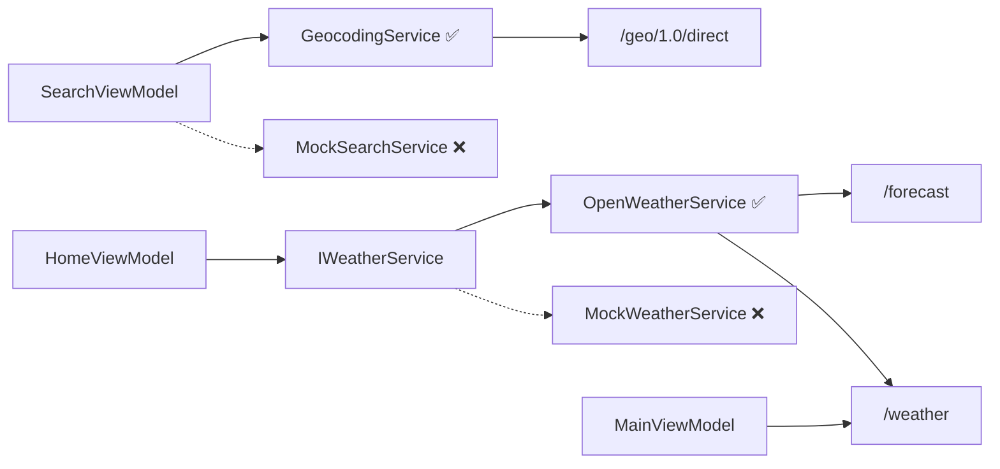

# Stage 4 워크스루 — OpenWeatherMap API 연동

## 개요

Stage 3까지 Mock 데이터로 완성된 UI를 **실제 OpenWeatherMap Free 2.5 API**로 교체했습니다.
추가로 검색 UX 개선(엔터 검색, 최근 검색 저장)과 °C ↔ °F 단위 전환 기능을 구현했습니다.

---

## 변경 파일 요약

| 파일 | 변경 | 설명 |
|------|------|------|
| `ApiConfig.cs` | 신규 | API 키 로드 + 단위 설정 중앙 관리 |
| `OpenWeatherService.cs` | 신규 | `/weather` + `/forecast` API 호출 |
| `GeocodingService.cs` | 신규 | Geocoding API 도시 검색 |
| `HomeViewModel.cs` | 수정 | 서비스 교체 + °C/°F 토글 |
| `SearchViewModel.cs` | 수정 | 서비스 교체 + 엔터 검색 + 최근 검색 저장 |
| `MainViewModel.cs` | 수정 | 즐겨찾기 실제 날씨 + 일출/일몰 |
| `HomeView.xaml` | 수정 | °C/°F 버튼 + 풍속 단위 동적 바인딩 |
| `SearchView.xaml` | 수정 | 엔터 키 바인딩 추가 |
| `App.xaml.cs` | 수정 | `ApiConfig.Load()` 호출 |
| `appsettings.json` | 신규 | API 키 저장 (gitignore 제외) |
| `appsettings.example.json` | 신규 | 템플릿 (git 커밋) |
| `.gitignore` | 수정 | `appsettings.json` 제외 |

---

## 1. API 키 안전 관리

```
SkyWatch/
├── appsettings.json          ← 실제 API 키 (git 추적 안됨)
├── appsettings.example.json  ← 템플릿 (git에 커밋됨)
└── Services/ApiConfig.cs     ← JSON에서 키를 읽어오는 로직
```

- `App.xaml.cs`의 `OnStartup`에서 `ApiConfig.Load()` 호출
- `ApiConfig.IsConfigured`로 키 유효성 검사

---

## 2. 서비스 교체 아키텍처



**핵심**: `IWeatherService` 인터페이스 덕분에 ViewModel은 1줄만 변경

```diff
-public HomeViewModel() : this(new MockWeatherService())
+public HomeViewModel() : this(new OpenWeatherService())
```

---

## 3. API 매핑

### 현재 날씨 (`/data/2.5/weather`)
| API 필드 | 모델 프로퍼티 | 변환 |
|----------|-------------|------|
| `main.temp` | `Temperature` | 그대로 |
| `main.feels_like` | `FeelsLike` | 그대로 |
| `weather[0].icon` | `IconCode` | 동일 형식 |
| `sys.sunrise` | `Sunrise` | Unix → DateTime |
| `wind.deg` | `WindDirection` | 각도 → "북서풍" |
| `visibility` | `Visibility` | m → km |

### 5일 예보 (`/data/2.5/forecast`)
- **시간별**: 가까운 6개 항목 → `HourlyForecast`
- **일별**: 날짜별 그룹핑 → 최고/최저 계산 → `DailyForecast`
- `TempBarRatio`: 전체 기간 대비 온도 비율 자동 계산

### 도시 검색 (`/geo/1.0/direct`)
- 국가코드 → 🇰🇷 국기 이모지 자동 변환
- `local_names.ko` → 한국어 도시명 우선 사용
- 각 결과의 현재 온도를 **병렬로** 조회

---

## 4. 검색 UX 개선

### 엔터 키 검색
기존에는 글자 입력마다 API 호출 → **엔터 키를 눌러야만** 검색 실행으로 변경

```diff
-partial void OnSearchQueryChanged(string value)
-{ _ = SearchCitiesAsync(value); }
+[RelayCommand]
+private async Task SearchAsync()
+{ await SearchCitiesAsync(SearchQuery); }
```

XAML에 `KeyBinding` 추가:
```xml
<TextBox.InputBindings>
    <KeyBinding Key="Return" Command="{Binding SearchCommand}"/>
</TextBox.InputBindings>
```

### 최근 검색 자동 저장
- 검색 결과가 있을 때 → `RecentSearches`에 자동 추가
- 중복 검색 시 맨 앞으로 이동
- 최대 8개 유지

---

## 5. °C ↔ °F 단위 전환

| 모드 | 온도 | 풍속 |
|------|------|------|
| `metric` | °C | m/s |
| `imperial` | °F | mph |

- `ApiConfig.Units`를 `const` → `static property`로 변경
- `HomeViewModel.ToggleUnitCommand` → 단위 전환 + 날씨 재호출
- UI 뱃지: 정적 텍스트 → 동적 바인딩 (`UnitLabel`, `WindUnitLabel`)
- 마우스 호버 효과 추가

---

## 검증 결과

- ✅ `dotnet build` — 0 에러, 0 경고
- ✅ `dotnet run` — 앱 정상 실행
- ✅ API 키 테스트 — Seoul: -2.2°C, 맑음
- ✅ 한국어 검색 — "서울", "오사카" 등 정상 동작
- ✅ °C ↔ °F 전환 — 온도 + 풍속 단위 동시 변경

---

## 남은 과제

- [ ] 검색 결과 클릭 → 해당 도시 홈 화면 표시
- [ ] 검색 결과 중복 제거 (같은 도시명 여러 개)
- [ ] 즐겨찾기 도시 추가/삭제 기능
- [ ] 설정 화면 구현
- [ ] 라이트 테마
