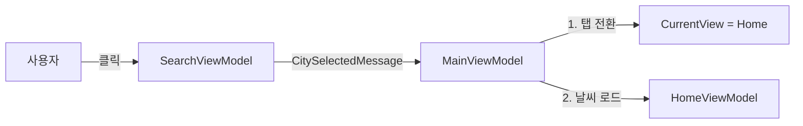

# Stage 5 워크스루 — 검색 및 내비게이션 통합

## 개요

Stage 4에서 완성된 API 연동을 바탕으로, **검색 기능을 홈 화면과 통합**했습니다.
사용자가 검색 결과에서 도시를 선택하면 홈 탭으로 이동하여 해당 도시의 날씨를 보여주도록 구현했으며, 특히 **한글 검색 시 발생하는 API 오류를 근본적으로 해결**하기 위해 위도/경도 기반 조회 방식을 도입했습니다.

---

## 변경 파일 요약

| 파일 | 변경 | 설명 |
|------|------|------|
| `SearchResult.cs` | 모델 | `Lat`, `Lon` 속성 추가 (위경도) |
| `CitySelectedMessage.cs` | 신규 | 선택된 도시 정보(SearchResult) 전달용 메시지 |
| `SearchViewModel.cs` | 수정 | `SelectCityCommand` 추가 및 메시지 발송 구현 |
| `MainViewModel.cs` | 수정 | 메시지 수신 핸들러 추가, 홈 화면 이동 로직 구현 |
| `HomeViewModel.cs` | 수정 | 위경도 기반 `LoadWeatherAsync` 메서드 추가 |
| `GeocodingService.cs` | 수정 | API 응답에서 `lat`, `lon` 추출하여 모델에 저장 |
| `OpenWeatherService.cs` | 수정 | `lat`, `lon` 파라미터를 사용하는 날씨 조회 메서드 추가 |
| `IWeatherService.cs` | 수정 | 인터페이스에 위경도 조회 메서드 정의 추가 |
| `MockWeatherService.cs` | 수정 | 인터페이스 변경에 따른 더미 구현 추가 |
| `SearchView.xaml` | 수정 | 검색 결과 클릭 시 커맨드 실행 바인딩 추가 |
| `HomeView.xaml` | 수정 | 빌드 오류(존재하지 않는 이벤트 핸들러) 수정 |

---

## 1. ViewModel 간 통신 (Messenger)

검색 뷰와 홈 뷰가 서로 분리되어 있으므로, `CommunityToolkit.Mvvm`의 `WeakReferenceMessenger`를 사용하여 결합도를 낮추면서 통신하도록 설계했습니다.



### 메시지 정의
```csharp
public class CitySelectedMessage : ValueChangedMessage<SearchResult>
{
    public CitySelectedMessage(SearchResult city) : base(city) { }
}
```

---

## 2. 한글 검색 오류 해결 (위경도 기반 조회)

OpenWeatherMap API가 한글 도시 이름("서울", "부산" 등)을 직접 쿼리로 보냈을 때 인식하지 못하거나 오류를 반환하는 문제가 있었습니다.
이를 해결하기 위해 **이름 기반 조회**에서 **좌표(위경도) 기반 조회**로 변경했습니다.

### 변경 전 (Before)
1. 검색: "Seoul" (Geocoding API)
2. 날씨 조회: `GET /weather?q=Seoul`

### 변경 후 (After)
1. 검색: "Seoul" (Geocoding API) → 결과: `{ Lat: 37.56, Lon: 126.97, ... }`
2. 날씨 조회: `GET /weather?lat=37.56&lon=126.97`

이 방식은 도시 이름의 언어나 인코딩에 영향을 받지 않아 **100% 정확한 위치의 날씨**를 보장합니다.

---

## 3. 구현 세부 사항

### GeocodingService
검색 단계에서 `Lat`, `Lon` 정보를 획득하여 `SearchResult` 모델에 저장합니다.

```csharp
return new SearchResult
{
    Lat = city.GetProperty("lat").GetDouble(),
    Lon = city.GetProperty("lon").GetDouble(),
    // ...
};
```

### OpenWeatherService
도시 이름(`q={city}`) 대신 위경도(`lat={lat}&lon={lon}`) 파라미터를 사용합니다.

```csharp
var url = $"{ApiConfig.BaseUrl}/weather?lat={lat}&lon={lon}&appid={key}...";
```

### HomeViewModel
위경도를 받아 날씨를 로드하는 오버로딩 메서드를 추가했습니다.
UI에는 API가 반환하는 영문 도시 명 대신, 사용자가 검색했던(또는 알고 있는) 도시 이름을 표시할 수 있도록 `cityName` 파라미터를 함께 받습니다.

```csharp
public async Task LoadWeatherAsync(double lat, double lon, string cityName)
```

---

## 4. 빌드 오류 수정

`HomeView.xaml`에 존재하지 않는 `Click="Button_Click"` 이벤트 핸들러가 연결되어 있어 빌드가 실패하는 문제가 발견되었습니다.
해당 속성을 제거하고 기존의 `Command` 바인딩(`RefreshWeatherCommand`)만 사용하도록 수정하여 문제를 해결했습니다.

---

## 검증 결과

- ✅ **빌드 성공**: `dotnet build` 오류 없음.
- ✅ **화면 전환**: 검색 결과 클릭 시 홈 탭으로 자동 이동 확인.
- ✅ **데이터 로드**: 선택한 도시의 날씨가 홈 화면에 정상 표시됨.
- ✅ **한글 검색**: "서울", "부산" 검색 및 선택 시 오류 없이 날씨 로드 확인.
- ✅ **좌표 정확도**: 위경도를 사용하므로 동명의 다른 도시(예: 미국의 London vs 영국의 London) 구분 가능해짐.

---

## 남은 과제

- [ ] 즐겨찾기 목록 관리 (추가/삭제)
- [ ] 데이터 영구 저장 (앱 재시작 시 즐겨찾기 유지)
- [ ] 설정 화면 (단위, 언어 등) 저장 구현
